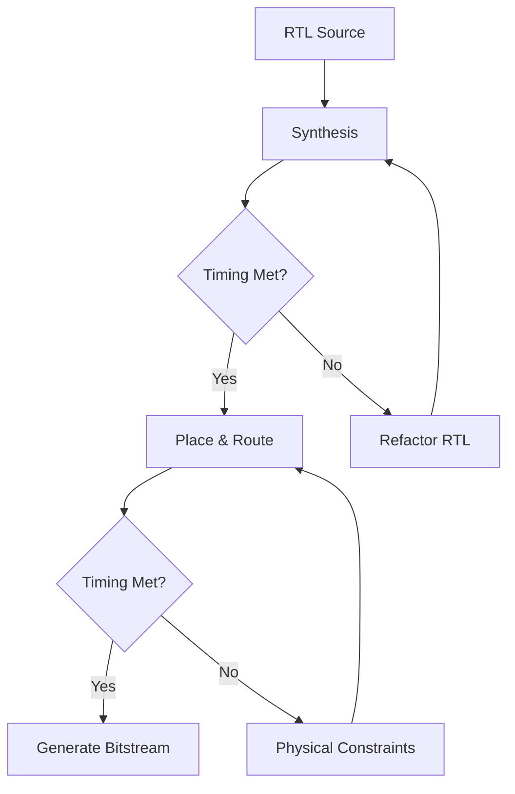

Timing closure is one of the most challenging aspects of FPGA design. When your design grows beyond a certain complexity, simply hitting "run implementation" and hoping for the best no longer works. You need a systematic approach.

## The Timing Closure Flow

At a high level, the process looks like this:



## Understanding Setup and Hold

The fundamental timing constraints come down to two checks. **Setup time** ensures data arrives at the destination register early enough before the clock edge. **Hold time** ensures data remains stable long enough after the clock edge.

For a path between two registers clocked at the same frequency:

- **Setup slack** = Clock Period - (Tclk_to_q + Tlogic + Trouting + Tsetup)
- **Hold slack** = Tclk_to_q + Tlogic + Trouting - Thold

## Common Strategies

### 1. Pipeline Aggressively

The most reliable fix for setup violations is to add pipeline stages. Consider a wide multiplier:

```verilog
// Before: combinational multiply — long path
assign result = a * b;

// After: registered multiply with pipeline
always @(posedge clk) begin
    mult_stage1 <= a * b;
    result      <= mult_stage1;  // extra cycle of latency
end
```

The tradeoff is latency, but for throughput-oriented designs this is almost always acceptable.

### 2. Use Physical Constraints

When RTL changes aren't feasible, `Pblock` constraints can help:

```tcl
create_pblock pblock_dsp_cluster
add_cells_to_pblock [get_pblocks pblock_dsp_cluster] [get_cells -hier -filter {NAME =~ */dsp_inst*}]
resize_pblock pblock_dsp_cluster -add {CLOCKREGION_X0Y0:CLOCKREGION_X1Y1}
```

### 3. Clock Domain Crossings

Whenever you cross between clock domains, use proper synchronization:

```verilog
// Two-flop synchronizer for single-bit signals
reg [1:0] sync_ff;
always @(posedge dest_clk) begin
    sync_ff <= {sync_ff[0], async_input};
end
wire synced = sync_ff[1];
```

For multi-bit buses, use a gray-coded FIFO or a handshake protocol instead.

## Vivado-Specific Tips

- **`report_timing_summary -delay_type min_max`** — Always check both setup and hold
- **`report_design_analysis -timing`** — Identifies congestion hotspots
- **`opt_design -directive ExploreWithRemap`** — Sometimes finds better logic optimization
- Use **incremental compilation** (`read_checkpoint -incremental`) when iterating on physical constraints

Timing closure is a skill that improves with practice. The key insight is that it's not just a tools problem — it starts at the architecture level.
